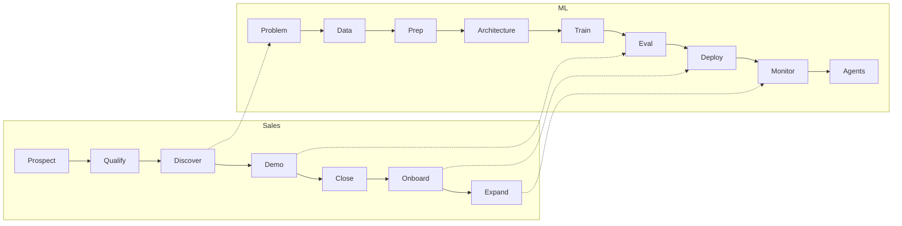

# AI Lifecycle 100

**100 datasets, models, domains, and architectures** mapped onto two operating systems:

1. **ML lifecycle** — problem → data → train → eval → deploy → monitor → agents
2. **Sales lifecycle** — prospect → qualify → discover → demo → close → onboard → expand

This is the starter kit that sits next to [200-dataset-websites](https://github.com/ahmaddroobi99/200-dataset-websites) (source hubs + papers) and the Vishnu.ai agent pack we pulled from the Facebook reel.

| File | What it is |
| --- | --- |
| [CATALOG.md](CATALOG.md) | The 100 resources, numbered, with type / domain / lifecycle step / why |
| [ML_LIFECYCLE.md](ML_LIFECYCLE.md) | 10 ML stages. Each stage lists the catalog IDs to open first |
| [SALES_LIFECYCLE.md](SALES_LIFECYCLE.md) | 8 sales stages. Each stage maps to the ML artifact a buyer actually wants |
| [AGENT_STACK.md](AGENT_STACK.md) | The 7 Vishnu.ai agent repos + token-savers from the Facebook reel |
| [notebooks/lifecycle.ipynb](notebooks/lifecycle.ipynb) | Same flow as **cells**. Run top to bottom. One cell = one stage |

## How to use this repo

1. Pick a **domain** from catalog items 71–85 (health, finance, code, robotics, …).
2. Walk [ML_LIFECYCLE.md](ML_LIFECYCLE.md) stage by stage. Do not skip eval.
3. If you are selling the system, walk [SALES_LIFECYCLE.md](SALES_LIFECYCLE.md) in parallel — each sales stage has the exact ML artifact to show.
4. Open `notebooks/lifecycle.ipynb` and treat each cell as a gate. A stage is done when the cell’s checklist is true.

## What “100” covers

| Bucket | Count | Catalog IDs |
| --- | --- | --- |
| Datasets | 30 | 1–30 |
| Models | 25 | 31–55 |
| Architectures + training methods | 15 | 56–70 |
| Domains | 15 | 71–85 |
| Tools / eval / serve / agents | 15 | 86–100 |

Licenses vary. Read the host card before commercial use.

Compiled August 2026 for [ahmaddroobi99](https://github.com/ahmaddroobi99).
